# Linux tool for System Administration

This tool is created to provide GUI for basic System Administration Tasks.

# Features!

1. Grub configuration
2. User Modification (Add, Edit Delete)
3. Memory and CPU usage of user and priority of process.
4. File permission and Umask.
5. Managing Log files.

### Screenshots

[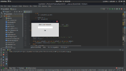](screenshot/screenshot-1.png)
[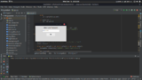](screenshot/screenshot-2.png)
[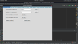](screenshot/screenshot-3.png)
[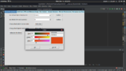](screenshot/screenshot-4.png)
[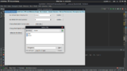](screenshot/screenshot-5.png)
[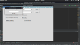](screenshot/screenshot-6.png)
[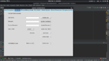](screenshot/screenshot-7.png)
[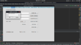](screenshot/screenshot-8.png)
[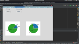](screenshot/screenshot-9.png)
[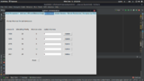](screenshot/screenshot-10.png)
[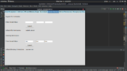](screenshot/screenshot-11.png)
[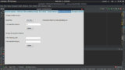](screenshot/screenshot-12.png)
[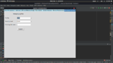](screenshot/screenshot-13.png)

### Requirements

Dillinger uses python and a number of python libraries to work properly:

* Python3 [`sudo apt-get install python3`]
* Python tkinter [`sudo apt-get install python python3-tk`]
* Pandas [`sudo apt-get install python3-pandas`]
* Matplotlib [`sudo apt-get install python3-plotly`]

### Execution

1.  Import the complete project in Pycharm (JetBrains IDE) and execute.
2.  Or, navigate to project folder and execute `python3 app.py`

